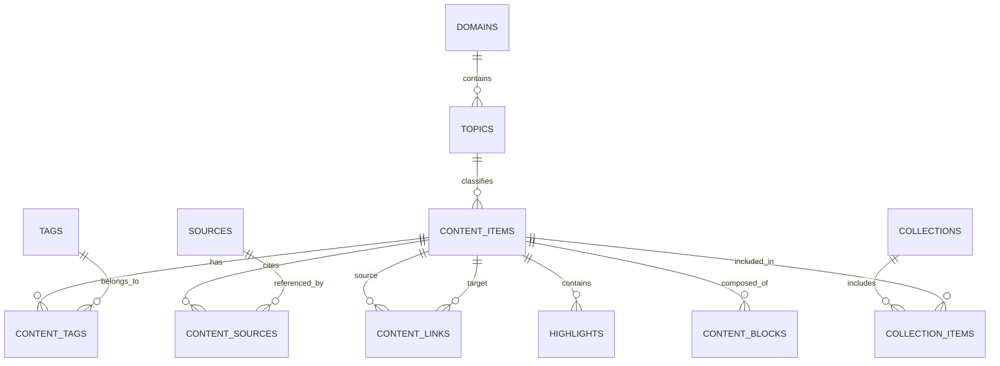

# 文章数据结构设计

版本：v0.1  
日期：2026-06-14  
适用产品：体验设计师知识系统 / 个人 Blog / Obsidian 知识库  
设计目标：让采集文章、个人理解、知识标签、专题组织和公开发布可以使用同一套内容模型。

---

## 1. 设计原则

文章不是孤立的 Blog Post，而是知识系统里的一个内容资产。它需要同时支持：

- 采集：保存外部文章链接、来源、作者、发布时间、推荐度。
- 理解：记录自己的摘要、关键观点、设计启发和应用场景。
- 组织：归入知识领域、主题、难度层级、标签和专题。
- 关联：连接相似文章、前置知识、案例、方法和自己的原创文章。
- 发布：从 inbox、精读、草稿到公开发布，保留状态变化。

因此推荐使用“统一内容模型”：用 `content_items` 管理所有内容，再通过 `content_type` 区分外部文章、原创文章、笔记、案例、方法卡片等类型。

---

## 2. 核心实体关系



---

## 3. 主表：content_items

用于承载文章、笔记、卡片、案例、方法论等所有知识内容。

| 字段 | 类型 | 必填 | 说明 |
| --- | --- | --- | --- |
| id | string / uuid | 是 | 内容唯一 ID |
| title | string | 是 | 文章或内容标题 |
| slug | string | 是 | URL 友好的唯一标识 |
| content_type | enum | 是 | `external_article` / `original_article` / `note` / `case_study` / `method_card` / `concept_card` |
| summary | text | 否 | 100-300 字摘要 |
| body | markdown | 否 | 正文或自己的整理内容 |
| cover_image | string | 否 | 封面图路径或 URL |
| domain_id | string | 是 | 所属知识领域，例如 Behavior / UX / Research |
| topic_id | string | 否 | 所属二级主题，例如 行为经济学、信息架构 |
| difficulty_level | enum | 是 | `L1` / `L2` / `L3` / `L4` / `L5` |
| learning_stage | enum | 否 | `入门概念` / `方法框架` / `实践案例` / `系统整合` / `研究前沿` |
| status | enum | 是 | `inbox` / `collected` / `reading` / `structured` / `draft` / `review` / `published` / `archived` |
| reading_status | enum | 否 | `unread` / `skimmed` / `read` / `deep_read` |
| language | string | 否 | `zh-CN` / `en` 等 |
| author_note | text | 否 | 自己的短评或采集理由 |
| key_takeaways | string[] | 否 | 核心收获，适合用于列表页预览 |
| design_insights | string[] | 否 | 对体验设计的启发 |
| applicable_scenarios | string[] | 否 | 可应用的产品场景 |
| confidence | enum | 否 | `low` / `medium` / `high`，表示自己对内容理解的把握 |
| priority | enum | 否 | `low` / `medium` / `high`，表示后续精读优先级 |
| published_at | datetime | 否 | 公开发布时间 |
| created_at | datetime | 是 | 创建时间 |
| updated_at | datetime | 是 | 更新时间 |

### content_type 建议

| 类型 | 用途 |
| --- | --- |
| external_article | 外部文章采集，只保存链接、摘要、笔记，不复制全文 |
| original_article | 自己写的公开长文 |
| note | 阅读笔记、临时想法、碎片记录 |
| concept_card | 概念卡片，例如损失厌恶、认知负荷 |
| method_card | 方法卡片，例如可用性测试、卡片分类 |
| case_study | 案例拆解，例如某产品的订阅取消流程 |

---

## 4. 分类表：domains

知识领域是稳定的大类，通常用于主导航、知识地图和学习路径。

| 字段 | 类型 | 必填 | 说明 |
| --- | --- | --- | --- |
| id | string | 是 | 领域 ID，例如 `behavior` |
| name | string | 是 | 中文名，例如 `人与行为` |
| name_en | string | 否 | 英文名，例如 `Behavior` |
| slug | string | 是 | URL 标识 |
| description | text | 否 | 领域说明 |
| sort_order | number | 是 | 展示顺序 |
| level_range | string | 否 | 覆盖难度，例如 `L1-L5` |

---

## 5. 主题表：topics

主题是领域下的二级分类，例如 `人与行为` 下有 `行为经济学`、`认知科学`、`动机理论`。

| 字段 | 类型 | 必填 | 说明 |
| --- | --- | --- | --- |
| id | string | 是 | 主题 ID |
| domain_id | string | 是 | 所属领域 |
| name | string | 是 | 主题名称 |
| slug | string | 是 | URL 标识 |
| description | text | 否 | 主题说明 |
| parent_topic_id | string | 否 | 支持三级主题 |
| sort_order | number | 是 | 展示顺序 |

---

## 6. 标签表：tags

标签用于跨领域快速聚合文章。一篇文章可以有多个标签，一个标签也可以连接多篇文章。

| 字段 | 类型 | 必填 | 说明 |
| --- | --- | --- | --- |
| id | string | 是 | 标签 ID |
| name | string | 是 | 标签名，例如 `认知负荷` |
| slug | string | 是 | URL 标识 |
| tag_group | enum | 是 | `concept` / `method` / `scenario` / `product` / `emotion` / `business` / `source` |
| description | text | 否 | 标签解释 |
| aliases | string[] | 否 | 同义词，例如 `cognitive load` |
| usage_count | number | 是 | 使用次数 |
| created_at | datetime | 是 | 创建时间 |
| updated_at | datetime | 是 | 更新时间 |

### 标签分组建议

| 分组 | 示例 |
| --- | --- |
| concept | 损失厌恶、默认效应、认知负荷、心智模型 |
| method | 可用性测试、用户访谈、卡片分类、启发式评估 |
| scenario | 注册、定价、取消订阅、搜索、导航、表单 |
| product | SaaS、内容社区、工具产品、电商、AI 产品 |
| emotion | 信任、焦虑、掌控感、安全感、惊喜 |
| business | 转化率、留存、订阅、增长、定价 |
| source | NNGroup、The Decision Lab、HBR、Baymard |

---

## 7. 内容标签关系表：content_tags

用于记录内容与标签的多对多关系。

| 字段 | 类型 | 必填 | 说明 |
| --- | --- | --- | --- |
| id | string / uuid | 是 | 关系 ID |
| content_id | string | 是 | 内容 ID |
| tag_id | string | 是 | 标签 ID |
| relevance | enum | 否 | `primary` / `secondary` / `mentioned` |
| created_at | datetime | 是 | 创建时间 |

---

## 8. 来源表：sources

来源保存外部文章、书籍、论文、报告、官网文档等信息。

| 字段 | 类型 | 必填 | 说明 |
| --- | --- | --- | --- |
| id | string / uuid | 是 | 来源 ID |
| title | string | 是 | 原文标题 |
| url | string | 否 | 原文链接 |
| source_type | enum | 是 | `article` / `book` / `paper` / `report` / `documentation` / `newsletter` |
| publisher | string | 否 | 发布方，例如 Nielsen Norman Group |
| author | string[] | 否 | 作者 |
| published_at | date | 否 | 原文发布时间 |
| accessed_at | date | 否 | 访问日期 |
| language | string | 否 | 语言 |
| copyright_note | text | 否 | 版权或使用备注 |
| reliability | enum | 否 | `high` / `medium` / `low` |

---

## 9. 内容来源关系表：content_sources

一篇原创文章可能引用多个来源，一篇外部文章采集通常对应一个主来源。

| 字段 | 类型 | 必填 | 说明 |
| --- | --- | --- | --- |
| id | string / uuid | 是 | 关系 ID |
| content_id | string | 是 | 内容 ID |
| source_id | string | 是 | 来源 ID |
| role | enum | 是 | `primary` / `reference` / `inspiration` / `counterpoint` |
| note | text | 否 | 引用说明 |

---

## 10. 摘录表：highlights

摘录只保存短句、页码、位置和自己的解释，避免复制整篇文章。

| 字段 | 类型 | 必填 | 说明 |
| --- | --- | --- | --- |
| id | string / uuid | 是 | 摘录 ID |
| content_id | string | 是 | 所属内容 |
| source_id | string | 否 | 对应来源 |
| quote | text | 是 | 短摘录 |
| location | string | 否 | 页码、章节、段落位置 |
| note | text | 否 | 自己的理解 |
| highlight_type | enum | 否 | `definition` / `insight` / `evidence` / `example` / `question` |
| created_at | datetime | 是 | 创建时间 |

---

## 11. 内容关系表：content_links

用于构建知识网络，而不是只靠分类目录查找内容。

| 字段 | 类型 | 必填 | 说明 |
| --- | --- | --- | --- |
| id | string / uuid | 是 | 关系 ID |
| source_content_id | string | 是 | 起点内容 |
| target_content_id | string | 是 | 终点内容 |
| relation_type | enum | 是 | 关系类型 |
| description | text | 否 | 关系说明 |
| strength | number | 否 | 关联强度，1-5 |
| created_at | datetime | 是 | 创建时间 |

### relation_type 建议

| 类型 | 说明 |
| --- | --- |
| explains | A 解释 B |
| applies_to | A 可应用于 B |
| example_of | A 是 B 的案例 |
| expands | A 扩展 B |
| contrasts_with | A 与 B 形成对比 |
| prerequisite_of | A 是 B 的前置知识 |
| cites | A 引用了 B |
| inspired_by | A 受到 B 启发 |

---

## 12. 内容块表：content_blocks

如果后续希望做更精细的编辑器、卡片化阅读或 AI 处理，可以把正文拆成结构化内容块。MVP 阶段可以先不做。

| 字段 | 类型 | 必填 | 说明 |
| --- | --- | --- | --- |
| id | string / uuid | 是 | 内容块 ID |
| content_id | string | 是 | 所属内容 |
| block_type | enum | 是 | `heading` / `paragraph` / `quote` / `list` / `image` / `callout` / `table` / `code` |
| body | markdown / json | 是 | 内容块正文 |
| sort_order | number | 是 | 排序 |
| metadata | json | 否 | 图片 alt、表格配置等 |

---

## 13. 专题表：collections

专题用于组织一组文章，例如“认知负荷入门阅读路径”“订阅取消体验案例库”。

| 字段 | 类型 | 必填 | 说明 |
| --- | --- | --- | --- |
| id | string | 是 | 专题 ID |
| title | string | 是 | 专题标题 |
| slug | string | 是 | URL 标识 |
| description | text | 否 | 专题说明 |
| collection_type | enum | 是 | `learning_path` / `topic_pack` / `case_library` / `reading_list` |
| status | enum | 是 | `draft` / `published` / `archived` |
| created_at | datetime | 是 | 创建时间 |
| updated_at | datetime | 是 | 更新时间 |

---

## 14. 专题内容关系表：collection_items

| 字段 | 类型 | 必填 | 说明 |
| --- | --- | --- | --- |
| id | string / uuid | 是 | 关系 ID |
| collection_id | string | 是 | 专题 ID |
| content_id | string | 是 | 内容 ID |
| sort_order | number | 是 | 在专题中的顺序 |
| section_title | string | 否 | 专题内分组标题 |
| note | text | 否 | 为什么放入这个专题 |

---

## 15. 附件表：assets

用于管理封面图、图表、截图、PDF、音频等资源。

| 字段 | 类型 | 必填 | 说明 |
| --- | --- | --- | --- |
| id | string / uuid | 是 | 附件 ID |
| content_id | string | 否 | 所属内容 |
| asset_type | enum | 是 | `image` / `pdf` / `diagram` / `screenshot` / `audio` |
| file_path | string | 是 | 本地路径或对象存储路径 |
| alt_text | string | 否 | 图片替代文本 |
| caption | string | 否 | 图片说明 |
| source_url | string | 否 | 原始来源 |
| license_note | text | 否 | 授权说明 |
| created_at | datetime | 是 | 创建时间 |

---

## 16. 状态流转

建议把文章处理流程设计成明确的状态机。

| 状态 | 含义 | 进入条件 |
| --- | --- | --- |
| inbox | 刚收集，还没判断价值 | 只有标题、链接、来源 |
| collected | 已确认值得保留 | 补充领域、主题、标签、推荐度 |
| reading | 正在阅读 | 开始记录摘录和问题 |
| structured | 已结构化理解 | 有摘要、关键观点、设计启发 |
| draft | 正在转化为自己的文章 | 开始写原创正文 |
| review | 待校对和合规检查 | 检查引用、版权、表达准确性 |
| published | 已公开发布 | 有 slug、发布时间、公开状态 |
| archived | 暂不使用 | 低相关、过时或质量不足 |

---

## 17. Obsidian Frontmatter 模板

适合当前阶段先在 Markdown 里使用，后续可以无损迁移到数据库。

```yaml
---
id: article_20260614_001
title: ""
slug: ""
content_type: external_article
status: inbox
reading_status: unread

domain: Behavior
topic: Behavioral Economics
difficulty_level: L1
learning_stage: 入门概念

source:
  title: ""
  url: ""
  publisher: ""
  author: []
  source_type: article
  published_at:
  accessed_at: 2026-06-14
  reliability: high

tags:
  - 认知负荷
  - 决策行为
primary_tags:
  - 认知负荷

priority: medium
confidence: medium
language: en

key_takeaways: []
design_insights: []
applicable_scenarios: []
related_contents: []

created_at: 2026-06-14
updated_at: 2026-06-14
published_at:
---
```

---

## 18. 单篇文章正文模板

```markdown
# 文章标题

## 1. 一句话摘要

用自己的话说明这篇文章解决了什么问题。

## 2. 核心观点

- 观点 1
- 观点 2
- 观点 3

## 3. 关键摘录

> 保存短摘录即可，避免复制整篇文章。

自己的理解：

## 4. 对体验设计的启发

- 可以影响哪个设计决策？
- 适合什么产品场景？
- 使用时有什么风险？

## 5. 可应用场景

- 注册 / 登录
- 定价 / 订阅
- 表单 / 任务流程
- 搜索 / 导航

## 6. 关联内容

- 前置概念：
- 相似文章：
- 对比观点：
- 可转化为原创文章的方向：

## 7. 处理记录

- 采集日期：
- 阅读状态：
- 后续动作：
```

---

## 19. JSON 示例

```json
{
  "id": "article_20260614_001",
  "title": "Minimize Cognitive Load to Maximize Usability",
  "slug": "minimize-cognitive-load-to-maximize-usability",
  "content_type": "external_article",
  "status": "structured",
  "reading_status": "deep_read",
  "domain_id": "behavior",
  "topic_id": "cognitive_science",
  "difficulty_level": "L1",
  "learning_stage": "入门概念",
  "summary": "这篇文章解释了认知负荷如何影响用户完成任务的能力，并提出减少不必要记忆、选择和理解成本的设计方向。",
  "key_takeaways": [
    "用户界面应该减少工作记忆压力",
    "识别优于回忆",
    "复杂任务需要分步呈现"
  ],
  "design_insights": [
    "表单可以通过默认值、分组和即时反馈降低认知负荷",
    "导航结构需要让用户知道当前位置和下一步"
  ],
  "applicable_scenarios": [
    "表单设计",
    "信息架构",
    "新手引导"
  ],
  "tags": [
    "认知负荷",
    "可用性",
    "信息架构"
  ],
  "sources": [
    {
      "title": "Minimize Cognitive Load to Maximize Usability",
      "url": "https://www.nngroup.com/articles/minimize-cognitive-load/",
      "publisher": "Nielsen Norman Group",
      "source_type": "article"
    }
  ],
  "created_at": "2026-06-14T00:00:00+08:00",
  "updated_at": "2026-06-14T00:00:00+08:00"
}
```

---

## 20. MVP 字段建议

如果先用 Obsidian 或静态站点，不需要一次实现所有表。第一阶段只保留这些字段即可：

```text
id
title
slug
content_type
status
reading_status
domain
topic
difficulty_level
source.title
source.url
source.publisher
tags
summary
key_takeaways
design_insights
applicable_scenarios
related_contents
created_at
updated_at
```

第二阶段再补充：

```text
content_links
collections
highlights
assets
content_blocks
revision_history
```

---

## 21. 常用查询场景

| 场景 | 需要字段 |
| --- | --- |
| 查看同标签文章 | `tags` / `content_tags` |
| 查看某个知识领域下的全部内容 | `domain_id` |
| 查看 L1 入门文章 | `difficulty_level` |
| 查看待读文章 | `status` + `reading_status` |
| 查找可写成原创文章的材料 | `content_type` + `status` + `priority` |
| 构建知识图谱 | `content_links` |
| 生成专题阅读路径 | `collections` + `collection_items` |

---

## 22. 索引建议

如果后续进入数据库，建议建立以下索引：

```text
content_items.slug
content_items.content_type
content_items.status
content_items.domain_id
content_items.topic_id
content_items.difficulty_level
tags.slug
content_tags.content_id
content_tags.tag_id
content_links.source_content_id
content_links.target_content_id
sources.url
```

如果支持全文搜索，优先索引：

```text
content_items.title
content_items.summary
content_items.body
tags.name
sources.title
```

---

## 23. 与当前采集清单的映射

当前 `L1入门概念层知识收集.md` 中的字段可以这样迁移：

| 当前字段 | 目标字段 |
| --- | --- |
| 文章 | `content_items.title` / `sources.title` |
| 来源 | `sources.publisher` |
| 链接 | `sources.url` |
| 推荐度 | `content_items.priority` |
| 章节，例如 2.1 人与行为 | `domains.name` |
| 子章节，例如 行为经济学 | `topics.name` |
| 搜索关键词 | `content_items.author_note` 或 `tags` |
| 建议标签 | `tags` + `content_tags` |

---

## 24. 命名建议

ID 建议使用可读前缀，方便本地文件和数据库同时使用：

```text
article_20260614_001
note_20260614_001
concept_cognitive_load
method_usability_testing
case_subscription_cancel_flow
```

Markdown 文件名建议：

```text
2026-06-14 - Minimize Cognitive Load to Maximize Usability.md
concept - 认知负荷.md
method - 可用性测试.md
case - 订阅取消流程拆解.md
```

---

## 25. 推荐落地方式

第一阶段使用 Obsidian：

- 每篇文章一个 Markdown 文件。
- 用 frontmatter 保存结构化字段。
- 正文使用固定模板记录摘要、摘录、启发和关联。
- 标签先用中文概念标签，英文词作为 aliases。

第二阶段建设静态站点：

- 从 Markdown frontmatter 生成文章列表、标签页、领域页和专题页。
- 将 `status: published` 的内容公开。
- 将 `external_article` 默认展示为“阅读笔记 / 资料卡”，避免误导为原创文章。

第三阶段迁移数据库：

- 将 Markdown frontmatter 导入 `content_items`。
- 将标签拆入 `tags` 和 `content_tags`。
- 将外部来源拆入 `sources` 和 `content_sources`。
- 将 `related_contents` 转为 `content_links`。
